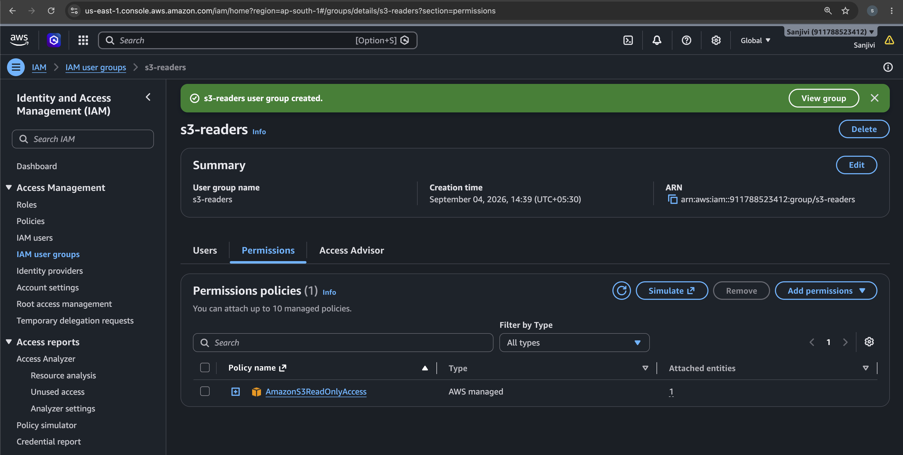
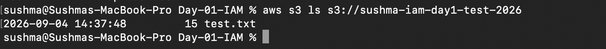
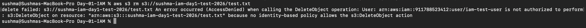

# AWS IAM Hands-On Lab – Day 01

## 📌 Project Overview

This project is a hands-on AWS IAM lab created as part of my AWS DevOps learning journey.

The objective of this lab was to understand how **AWS Identity and Access Management (IAM)** controls access to AWS resources using **IAM users, groups, and policies**.

I created an IAM user with read-only access to an Amazon S3 bucket and tested different S3 operations using the AWS CLI.

The user was able to list and read S3 objects but was not allowed to upload or delete objects.

This demonstrates the **Principle of Least Privilege**.

---

## 🏗️ Architecture / Permission Flow

```text
                         AWS IAM
                            │
                            ↓
                    iam-test-user
                            │
                            ↓
                       s3-readers
                       IAM Group
                            │
                            ↓
                  AmazonS3ReadOnlyAccess
                      IAM Policy
                            │
                            ↓
                  Amazon S3 Bucket
              sushma-iam-day1-test-2026
                            │
                 ┌──────────┼──────────┐
                 ↓          ↓          ↓
               List/Read   Upload     Delete
                  ✅          ❌          ❌
                Allowed     Denied     Denied
```

---

# 🎯 Objectives

* Understand AWS IAM fundamentals
* Understand IAM users
* Understand IAM groups
* Understand IAM policies
* Create an IAM user
* Create an IAM group
* Attach an IAM policy to a group
* Add an IAM user to the group
* Understand AWS managed policies
* Configure AWS CLI authentication
* Verify IAM identity using AWS STS
* Test S3 permissions using AWS CLI
* Understand `AccessDenied` errors
* Understand the Principle of Least Privilege

---

# ☁️ AWS Services Used

## 1. AWS IAM

AWS IAM was used to manage the identity and permissions required for the lab.

### Resources Created

* **IAM User:** `iam-test-user`
* **IAM Group:** `s3-readers`
* **IAM Policy:** `AmazonS3ReadOnlyAccess`

---

## 2. Amazon S3

Amazon S3 was used as the AWS resource on which IAM permissions were tested.

### S3 Bucket

```text
sushma-iam-day1-test-2026
```

### Test Object

```text
test.txt
```

---

## 3. AWS CLI

The AWS CLI was used to authenticate and interact with AWS resources from the terminal.

---

## 4. AWS STS

AWS STS was used to verify the IAM identity currently being used by the AWS CLI.

Command used:

```bash
aws sts get-caller-identity
```

---

# 🔐 IAM Configuration

## IAM User

Created an IAM user:

```text
iam-test-user
```

This user was used to test AWS permissions through the AWS CLI.

An IAM user represents an identity within an AWS account that can authenticate and access AWS resources according to its permissions.

---

## IAM Group

Created an IAM group:

```text
s3-readers
```

The IAM user `iam-test-user` was added to this group.

An IAM group is a collection of IAM users. Policies can be attached to the group, and users in the group receive those permissions.

---

## IAM Policy

Attached the AWS managed policy:

```text
AmazonS3ReadOnlyAccess
```

This policy provides read-only access to Amazon S3.

Therefore, the IAM user could perform read/list operations but did not have permissions such as:

```text
s3:PutObject
s3:DeleteObject
```

---

# 📄 IAM Policy Structure

An IAM policy is a JSON document that defines permissions.

A typical IAM policy contains:

```text
Version
Statement
Effect
Action
Resource
Condition
```

`Principal` is used when a policy needs to specify the principal, such as in resource-based policies. It is not required in every IAM policy.

### Important Policy Elements

| Element     | Meaning                                            |
| ----------- | -------------------------------------------------- |
| `Version`   | Specifies the policy language version              |
| `Statement` | Contains one or more permission statements         |
| `Effect`    | Specifies `Allow` or `Deny`                        |
| `Action`    | Specifies the AWS API actions                      |
| `Resource`  | Specifies the AWS resource                         |
| `Condition` | Adds additional conditions to a permission         |
| `Principal` | Specifies who is allowed or denied when applicable |

---

# 🔑 Authentication vs Authorization

## Authentication

**Authentication answers: "Who are you?"**

In this lab, the AWS CLI used IAM user credentials to authenticate the request.

Command:

```bash
aws sts get-caller-identity
```

The output confirmed that the AWS CLI was using:

```text
iam-test-user
```

---

## Authorization

**Authorization answers: "What are you allowed to do?"**

In this lab:

```text
List S3 objects → Allowed
Read S3 objects → Allowed
Upload objects  → Denied
Delete objects  → Denied
```

Therefore:

```text
Authentication → Who are you?
Authorization  → What can you do?
```

---

# 🖥️ AWS CLI Configuration

The AWS CLI was configured using the IAM user's access credentials.

Command used:

```bash
aws configure
```

Region:

```text
ap-south-1
```

`ap-south-1` is the AWS Mumbai Region.

The AWS CLI was then used to test the permissions assigned to `iam-test-user`.

---

# 🔎 Verify IAM Identity

Command:

```bash
aws sts get-caller-identity
```

This command verifies the AWS identity currently being used by the AWS CLI.

The output confirmed that the CLI was using:

```text
iam-test-user
```

---

# 🧪 Permission Testing

## Test 1 – List S3 Buckets

Command:

```bash
aws s3 ls
```

### Result

```text
Allowed ✅
```

The IAM user was able to list S3 buckets.

---

## Test 2 – List Objects in the S3 Bucket

Command:

```bash
aws s3 ls s3://sushma-iam-day1-test-2026
```

The output showed:

```text
test.txt
```

### Result

```text
Allowed ✅
```

The IAM user was able to list objects in the bucket.

---

## Test 3 – Upload an Object

Command:

```bash
aws s3 cp upload-test.txt s3://sushma-iam-day1-test-2026/
```

### Result

```text
AccessDenied ❌
```

The request required the permission:

```text
s3:PutObject
```

The `AmazonS3ReadOnlyAccess` policy does not provide permission to upload objects.

Therefore:

```text
s3:PutObject → AccessDenied ❌
```

---

## Test 4 – Delete an Object

Command:

```bash
aws s3 rm s3://sushma-iam-day1-test-2026/test.txt
```

### Result

```text
AccessDenied ❌
```

The request required:

```text
s3:DeleteObject
```

The `AmazonS3ReadOnlyAccess` policy does not provide permission to delete objects.

Therefore:

```text
s3:DeleteObject → AccessDenied ❌
```

---

# 📊 Permission Test Results

| Operation           | Permission / API Action | Result    |
| ------------------- | ----------------------- | --------- |
| List S3 buckets     | `s3:ListAllMyBuckets`   | ✅ Allowed |
| List bucket objects | `s3:ListBucket`         | ✅ Allowed |
| Read S3 objects     | `s3:GetObject`          | ✅ Allowed |
| Upload object       | `s3:PutObject`          | ❌ Denied  |
| Delete object       | `s3:DeleteObject`       | ❌ Denied  |

> **Note:** The exact permissions evaluated by AWS can vary depending on the AWS CLI command and the underlying API calls.

---

# 🚫 Understanding AccessDenied

An `AccessDenied` error occurs when the IAM identity does not have sufficient permission for the requested AWS action.

For example:

```text
s3:PutObject
      ↓
No applicable Allow
      ↓
AccessDenied
```

And:

```text
s3:DeleteObject
      ↓
No applicable Allow
      ↓
AccessDenied
```

In this lab, the user had read-only S3 permissions, so upload and delete operations were not permitted.

---

# 🔐 Principle of Least Privilege

The **Principle of Least Privilege** means giving a user, application, or service only the permissions required to perform its intended tasks.

In this lab, the user only required read access to S3.

Instead of providing full S3 access, the following AWS managed policy was assigned:

```text
AmazonS3ReadOnlyAccess
```

As a result:

```text
Read/List → Allowed ✅
Upload    → Denied ❌
Delete    → Denied ❌
```

This reduces unnecessary permissions and improves security.

---

# 📚 What I Learned

## IAM Fundamentals

I learned:

* What AWS IAM is
* IAM Users
* IAM Groups
* IAM Policies
* Authentication
* Authorization
* Allow and Deny
* Implicit Deny
* Principle of Least Privilege

---

## IAM User

An IAM user represents an identity within an AWS account that can authenticate and interact with AWS resources according to its permissions.

---

## IAM Group

An IAM group is a collection of IAM users.

Permissions can be assigned to the group, allowing its users to receive those permissions.

In this lab:

```text
iam-test-user
      ↓
s3-readers
      ↓
S3 Read Permissions
```

---

## IAM Policy

An IAM policy is a JSON-based document that defines permissions.

It specifies what actions are allowed or denied on which resources and can optionally include conditions.

Important policy elements include:

```text
Version
Statement
Effect
Action
Resource
Condition
```

---

## AWS Managed Policy

I used the AWS managed policy:

```text
AmazonS3ReadOnlyAccess
```

This policy provides read-only access to Amazon S3.

---

## Allow and Deny

AWS access is generally denied unless an applicable policy provides an `Allow`.

An **explicit Deny overrides an Allow**.

In this lab, the upload and delete operations were denied because the user did not have the required permissions.

---

## AWS CLI

I learned how to configure and use the AWS CLI:

```bash
aws configure
```

I also practiced AWS S3 commands such as:

```bash
aws s3 ls
```

```bash
aws s3 ls s3://bucket-name
```

```bash
aws s3 cp file.txt s3://bucket-name/
```

```bash
aws s3 rm s3://bucket-name/file.txt
```

---

## AWS STS

I learned how to verify the currently authenticated AWS identity using:

```bash
aws sts get-caller-identity
```

---

# 🛠️ Commands Practiced

```bash
aws configure
```

```bash
aws sts get-caller-identity
```

```bash
aws s3 ls
```

```bash
aws s3 ls s3://sushma-iam-day1-test-2026
```

```bash
aws s3 cp upload-test.txt s3://sushma-iam-day1-test-2026/
```

```bash
aws s3 rm s3://sushma-iam-day1-test-2026/test.txt
```

---

# 📸 Screenshots

## 1. IAM Group

Shows the `s3-readers` IAM group and its attached S3 read-only policy.



---

## 2. IAM User

Shows the `iam-test-user` IAM user and its group membership.


---

## 3. S3 Read Access

Shows successful access to list objects in the S3 bucket.



---

## 4. S3 Upload Denied

Shows `AccessDenied` for the `s3:PutObject` operation.


---

## 5. S3 Delete Denied

Shows `AccessDenied` for the `s3:DeleteObject` operation.



---

# 💡 Key Takeaway

This lab demonstrated how AWS IAM controls access to AWS resources using **users, groups, and policies**.

The IAM user `iam-test-user` received S3 read permissions through the `s3-readers` group.

The permission flow was:

```text
iam-test-user
      ↓
s3-readers
      ↓
AmazonS3ReadOnlyAccess
      ↓
S3
```

The resulting access was:

```text
                S3
                 │
        ┌────────┼────────┐
        ↓        ↓        ↓
      Read     Upload   Delete
        ✅        ❌        ❌
```

This hands-on lab demonstrates the importance of **least-privilege access control in AWS**.

---

# 🚀 Next Learning Topics

After completing this IAM Day 1 lab, the next IAM topics are:

* IAM Policy Types
* Identity-Based Policies
* Resource-Based Policies
* Trust Policies
* Permissions Policies
* Inline Policies
* AWS Managed Policies
* Customer Managed Policies
* Policy Evaluation Logic
* Explicit Deny vs Allow
* IAM Roles
* EC2 IAM Roles
* Instance Profiles
* STS Temporary Credentials
* Permissions Boundaries
* Service Control Policies (SCPs)
* Cross-Account IAM Roles
* IAM Troubleshooting
* OIDC and GitHub Actions

---

# 👩‍💻 Project Status

**Status:** Completed ✅

**Day:** 01

**Topic:** AWS IAM

**Hands-on:** IAM + S3 + AWS CLI + STS

**Key Security Concept:** Principle of Least Privilege

