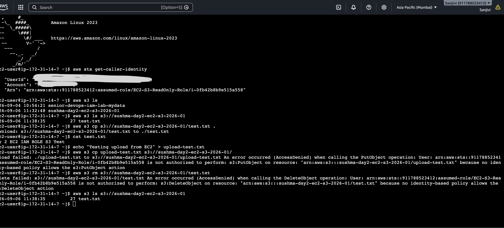
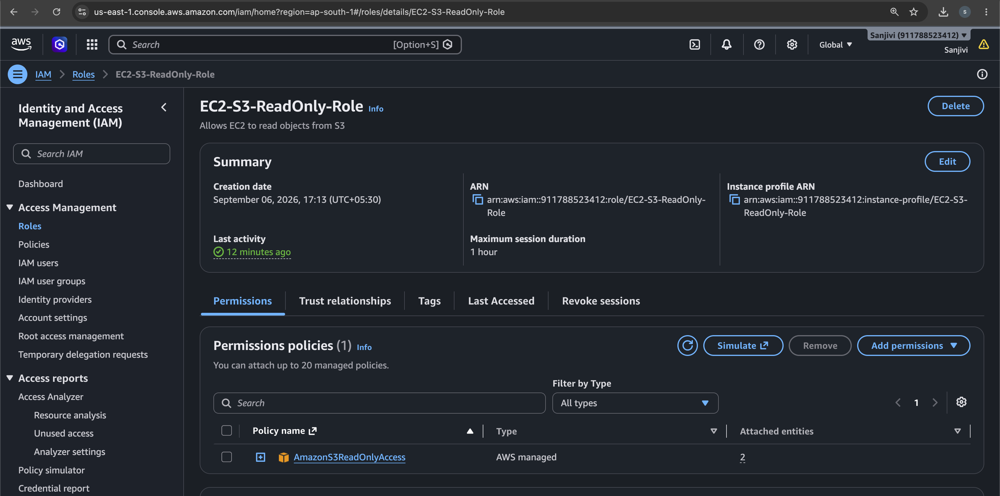

# Day 2 — EC2 IAM Role → Amazon S3

## 📌 Project Overview

This project demonstrates how an **Amazon EC2 instance securely accesses an Amazon S3 bucket using an IAM Role**.

Instead of storing AWS access keys on the EC2 instance, an IAM Role was attached to the EC2 instance. The role provides temporary credentials automatically.

The role was configured with **AmazonS3ReadOnlyAccess**, allowing the EC2 instance to list and download objects from S3 while preventing upload and delete operations.

---

## 🎯 Objectives

* Create an Amazon S3 bucket.
* Create an IAM Role for EC2.
* Attach `AmazonS3ReadOnlyAccess` to the role.
* Launch an EC2 instance with the IAM Role.
* Verify the IAM Role from inside EC2.
* Access S3 using AWS CLI.
* Successfully download an S3 object.
* Verify that upload and delete operations are denied.
* Understand the Principle of Least Privilege.

---

## 🏗️ Architecture

```text
                    AWS Account
                         |
                         |
                    IAM Role
          EC2-S3-ReadOnly-Role
                         |
                         |
                Amazon EC2 Instance
                         |
                    AWS CLI
                         |
                         |
                  Amazon S3 Bucket
                         |
                      test.txt
```

### Access Flow

```text
EC2 Instance
     |
     | Uses IAM Role
     ↓
EC2-S3-ReadOnly-Role
     |
     | AmazonS3ReadOnlyAccess
     ↓
Amazon S3
```

---

# 1. Amazon S3 Bucket

Created an S3 bucket:

```text
sushma-day2-ec2-s3-2026-01
```

Region:

```text
ap-south-1
```

Uploaded the following test file:

```text
test.txt
```

File content:

```text
Day 2 EC2 IAM ROLE S3 Test
```

---

# 2. IAM Role

Created an IAM Role:

```text
EC2-S3-ReadOnly-Role
```

### Trusted Entity

```text
EC2
```

This allows EC2 instances to assume the role.

### Permission Policy

```text
AmazonS3ReadOnlyAccess
```

This provides read-only access to Amazon S3.

---

# 3. EC2 Instance

Created an EC2 instance:

```text
day2-ec2-s3-test
```

Configuration:

* AMI: Amazon Linux 2023
* Instance Type: `t3.micro`
* IAM Role: `EC2-S3-ReadOnly-Role`
* Region: `ap-south-1`

Connected to the instance using **EC2 Instance Connect**.

---

# 4. Verify IAM Role

Inside the EC2 instance, verified the identity using:

```bash
aws sts get-caller-identity
```

This confirmed that the EC2 instance was operating using the attached IAM Role rather than manually configured AWS access keys.

---

# 5. List S3 Buckets

Executed:

```bash
aws s3 ls
```

The Day 2 S3 bucket was successfully displayed.

---

# 6. List Objects in S3

Executed:

```bash
aws s3 ls s3://sushma-day2-ec2-s3-2026-01
```

The object was displayed:

```text
test.txt
```

---

# 7. Download Object from S3

Executed:

```bash
aws s3 cp s3://sushma-day2-ec2-s3-2026-01/test.txt .
```

The download completed successfully.

Verified the file using:

```bash
cat test.txt
```

Output:

```text
Day 2 EC2 IAM ROLE S3 Test
```

This proves that the EC2 instance has permission to read objects from S3.

---

# 8. Test Upload Permission

Created a test file:

```bash
touch upload-test.txt
```

Attempted to upload it:

```bash
aws s3 cp upload-test.txt s3://sushma-day2-ec2-s3-2026-01/
```

The operation failed with:

```text
AccessDenied
```

This is expected because the IAM Role has read-only S3 permissions and does not allow:

```text
s3:PutObject
```

---

# 9. Test Delete Permission

Attempted to delete the existing S3 object:

```bash
aws s3 rm s3://sushma-day2-ec2-s3-2026-01/test.txt
```

The operation failed with:

```text
AccessDenied
```

This is expected because the IAM Role does not have:

```text
s3:DeleteObject
```

---

# 10. Final Verification

Executed:

```bash
aws s3 ls s3://sushma-day2-ec2-s3-2026-01
```

The object was still present:

```text
test.txt
```

This confirms:

| Operation            | Result    |
| -------------------- | --------- |
| List S3 bucket       | ✅ Allowed |
| Read/Download object | ✅ Allowed |
| Upload object        | ❌ Denied  |
| Delete object        | ❌ Denied  |

---

# 🔐 Least Privilege

This project demonstrates the **Principle of Least Privilege**.

The EC2 instance received only the permissions required for the task.

```text
IAM Role
    ↓
AmazonS3ReadOnlyAccess
    ↓
List / Read / Download
```

It does not have permission to modify or delete S3 objects.

---

# 🔑 Why IAM Role Instead of Access Keys?

Using an IAM Role with EC2 is more secure than storing long-term AWS access keys on the server.

### IAM Role

* No long-term access keys need to be stored on the EC2 instance.
* Temporary credentials are provided automatically.
* Credentials are managed by AWS.
* Permissions can be controlled through IAM policies.
* Better security practice for AWS workloads.

### Access Keys

Storing long-term access keys on an EC2 server can create security risks if the credentials are exposed.

Therefore:

```text
EC2 + IAM Role
```

is the preferred approach for applications running on EC2 that need AWS service access.

---

# 🛠️ AWS Services Used

| Service    | Purpose                           |
| ---------- | --------------------------------- |
| Amazon EC2 | Compute instance                  |
| AWS IAM    | Identity and access management    |
| Amazon S3  | Object storage                    |
| AWS CLI    | Command-line interaction with AWS |

---

# 📸 Screenshots

### 1. EC2 IAM Role → S3 Access Test



### 2. IAM Role Configuration



---

# 📚 Key Learnings

Through this project, I learned:

* How IAM Roles work with EC2.
* How EC2 obtains temporary AWS credentials.
* How to verify an IAM Role using `aws sts get-caller-identity`.
* How EC2 can access S3 without storing long-term access keys.
* How IAM policies control AWS API permissions.
* How read-only permissions prevent unauthorized modifications.
* How to test permissions using AWS CLI.
* The importance of the Principle of Least Privilege.

---

## ✅ Project Status

**Completed**

This project demonstrates a secure EC2-to-S3 integration using an IAM Role and read-only permissions.

