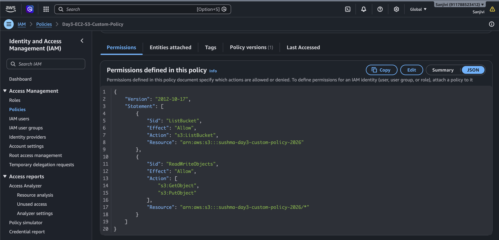
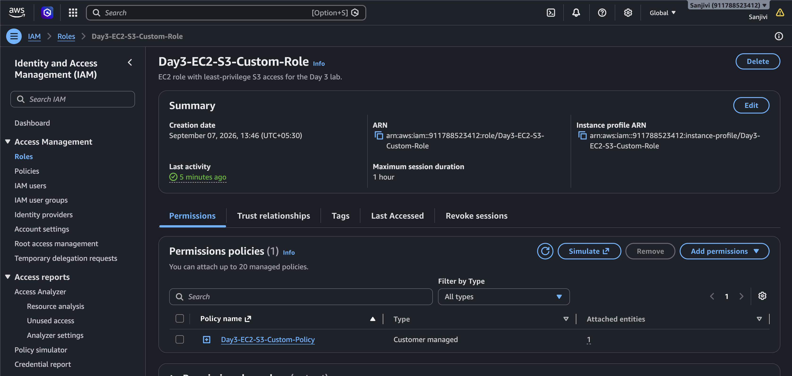
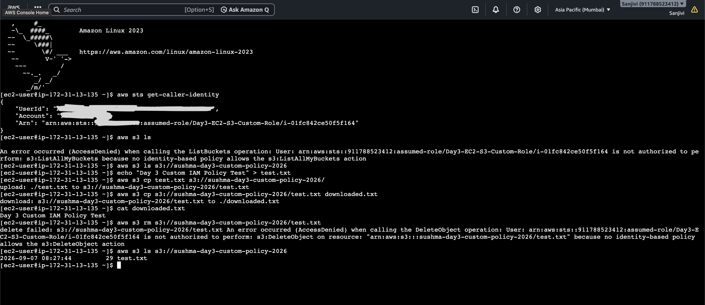

# Day 3 — EC2 → S3 Using Custom IAM Policy

## 📌 Project Overview

This project demonstrates how to securely provide an Amazon EC2 instance with specific Amazon S3 permissions using a **customer-managed IAM policy**.

Instead of using a broad policy such as `AmazonS3FullAccess`, I created a custom IAM policy following the **Principle of Least Privilege**.

The custom policy allows the EC2 instance to:

* List objects in one specific S3 bucket
* Upload objects
* Download objects

The policy does not allow:

* Listing all S3 buckets
* Deleting objects

This project demonstrates practical understanding of **IAM Policies, IAM Roles, EC2, S3, AWS STS, resource-level permissions, and least-privilege access**.

---

## 🎯 Objectives

* Create a customer-managed IAM policy.
* Understand IAM policy JSON.
* Grant specific S3 permissions.
* Create an IAM Role for EC2.
* Attach the custom policy to the role.
* Assign the role to an EC2 instance.
* Access S3 from EC2 using AWS CLI.
* Test allowed and denied operations.
* Demonstrate the Principle of Least Privilege.

---

## 🏗️ Architecture

```text
                    AWS Account
                         │
                         ▼
              ┌─────────────────────┐
              │      IAM Role       │
              │                     │
              │ Day3-EC2-S3-        │
              │ Custom-Role         │
              └──────────┬──────────┘
                         │
                         │ Attached Policy
                         ▼
              ┌─────────────────────┐
              │   Custom IAM Policy │
              │                     │
              │ s3:ListBucket       │
              │ s3:GetObject        │
              │ s3:PutObject        │
              └──────────┬──────────┘
                         │
                         ▼
                  ┌─────────────┐
                  │     EC2     │
                  │ Amazon Linux│
                  │    2023     │
                  └──────┬──────┘
                         │
                         │ AWS CLI
                         ▼
              ┌─────────────────────┐
              │     Amazon S3       │
              │                     │
              │ sushma-day3-        │
              │ custom-policy-2026 │
              └─────────────────────┘
```

---

## ☁️ AWS Services Used

| AWS Service | Purpose                              |
| ----------- | ------------------------------------ |
| IAM         | Identity and access management       |
| IAM Role    | Provides permissions to EC2          |
| IAM Policy  | Defines allowed S3 actions           |
| EC2         | Compute instance used for testing    |
| Amazon S3   | Object storage                       |
| AWS STS     | Verified the IAM Role assumed by EC2 |
| AWS CLI     | Tested S3 operations from EC2        |

---

## 🔐 IAM Custom Policy

### Policy Name

```text
Day3-EC2-S3-Custom-Policy
```

### Policy Type

```text
Customer managed policy
```

### Policy Description

```text
Allows EC2 to list, read, and upload objects only in the Day 3 S3 bucket.
```

### Policy JSON

```json
{
  "Version": "2012-10-17",
  "Statement": [
    {
      "Sid": "ListBucket",
      "Effect": "Allow",
      "Action": "s3:ListBucket",
      "Resource": "arn:aws:s3:::sushma-day3-custom-policy-2026"
    },
    {
      "Sid": "ReadWriteObjects",
      "Effect": "Allow",
      "Action": [
        "s3:GetObject",
        "s3:PutObject"
      ],
      "Resource": "arn:aws:s3:::sushma-day3-custom-policy-2026/*"
    }
  ]
}
```

---

## 🧩 Policy Permissions

The policy contains two permission statements.

### 1. `s3:ListBucket`

Allows the EC2 instance to list objects inside the specific S3 bucket.

Resource:

```text
arn:aws:s3:::sushma-day3-custom-policy-2026
```

This is a **bucket-level ARN**.

### 2. `s3:GetObject`

Allows the EC2 instance to read/download objects from the bucket.

### 3. `s3:PutObject`

Allows the EC2 instance to upload objects into the bucket.

Object resource:

```text
arn:aws:s3:::sushma-day3-custom-policy-2026/*
```

The `/*` represents objects inside the bucket.

---

## ❌ Permissions Not Granted

The custom policy does not include:

```text
s3:ListAllMyBuckets
```

Therefore, the EC2 instance cannot list all S3 buckets.

It also does not include:

```text
s3:DeleteObject
```

Therefore, the EC2 instance cannot delete objects.

This demonstrates the **Principle of Least Privilege**.

---

## 👤 IAM Role

### Role Name

```text
Day3-EC2-S3-Custom-Role
```

### Trusted Entity

```text
EC2
```

The role allows EC2 to assume the role and obtain temporary credentials for accessing AWS services.

### Attached Policy

```text
Day3-EC2-S3-Custom-Policy
```

Only the required custom policy was attached to the role.

---

## 💻 EC2 Configuration

### Instance Name

```text
day3-ec2-custom-policy
```

### Operating System

```text
Amazon Linux 2023
```

### Instance Type

```text
t3.micro
```

### IAM Role

```text
Day3-EC2-S3-Custom-Role
```

The EC2 instance accessed S3 using the IAM Role instead of storing AWS access keys on the server.

---

## 🪣 S3 Configuration

### Bucket Name

```text
sushma-day3-custom-policy-2026
```

### Region

```text
ap-south-1
```

The bucket was used to test the custom IAM permissions.

---

# 🧪 Testing

## 1. Verify IAM Role

Command:

```bash
aws sts get-caller-identity
```

The command confirmed that the EC2 instance was using the IAM Role:

```text
Day3-EC2-S3-Custom-Role
```

This verified that EC2 successfully assumed the IAM Role.

---

## 2. Test Listing All S3 Buckets

Command:

```bash
aws s3 ls
```

Result:

```text
AccessDenied
```

The request was denied because the custom policy does not grant:

```text
s3:ListAllMyBuckets
```

This was expected and demonstrates least-privilege access.

---

## 3. Test Specific S3 Bucket Listing

Command:

```bash
aws s3 ls s3://sushma-day3-custom-policy-2026
```

Result:

```text
Success
```

The specific bucket could be accessed because the policy grants:

```text
s3:ListBucket
```

for that bucket.

---

## 4. Create Test File

Command:

```bash
echo "Day 3 Custom IAM Policy Test" > test.txt
```

A test file was created on the EC2 instance.

---

## 5. Upload Object

Command:

```bash
aws s3 cp test.txt s3://sushma-day3-custom-policy-2026/
```

Result:

```text
Upload successful
```

Permission used:

```text
s3:PutObject
```

---

## 6. Download Object

Command:

```bash
aws s3 cp s3://sushma-day3-custom-policy-2026/test.txt downloaded.txt
```

Result:

```text
Download successful
```

Permission used:

```text
s3:GetObject
```

---

## 7. Verify Downloaded File

Command:

```bash
cat downloaded.txt
```

Output:

```text
Day 3 Custom IAM Policy Test
```

This confirmed that the object was successfully downloaded from S3.

---

## 8. Test Delete Operation

Command:

```bash
aws s3 rm s3://sushma-day3-custom-policy-2026/test.txt
```

Result:

```text
AccessDenied
```

The operation was denied because the custom policy does not contain:

```text
s3:DeleteObject
```

This confirms that the policy is working according to the intended permissions.

---

## 9. Verify Object Still Exists

Command:

```bash
aws s3 ls s3://sushma-day3-custom-policy-2026
```

Result:

```text
test.txt
```

The object remained in the bucket because the delete operation was denied.

---

## 📊 Permission Test Results

| Operation            | IAM Permission        | Result    |
| -------------------- | --------------------- | --------- |
| List all S3 buckets  | `s3:ListAllMyBuckets` | ❌ Denied  |
| List specific bucket | `s3:ListBucket`       | ✅ Allowed |
| Upload object        | `s3:PutObject`        | ✅ Allowed |
| Download object      | `s3:GetObject`        | ✅ Allowed |
| Delete object        | `s3:DeleteObject`     | ❌ Denied  |

---

## 🔒 Principle of Least Privilege

The custom policy grants only the permissions required for this project:

```text
s3:ListBucket
s3:GetObject
s3:PutObject
```

The permissions are restricted to the specific Day 3 S3 bucket.

No permission was granted for:

```text
s3:ListAllMyBuckets
s3:DeleteObject
```

This reduces unnecessary access and follows the **Principle of Least Privilege**.

---

## 🔄 Complete Access Flow

```text
EC2 Instance
     │
     │ Assumes
     ▼
IAM Role
Day3-EC2-S3-Custom-Role
     │
     │ Attached Policy
     ▼
Custom IAM Policy
Day3-EC2-S3-Custom-Policy
     │
     │ IAM Authorization
     ▼
Amazon S3
     │
     ├── ListBucket       → ✅ Allowed
     ├── GetObject        → ✅ Allowed
     ├── PutObject        → ✅ Allowed
     ├── ListAllMyBuckets → ❌ Denied
     └── DeleteObject     → ❌ Denied
```

---

## 🔑 Why IAM Role Instead of Access Keys?

The EC2 instance did not store an IAM user's:

```text
AWS_ACCESS_KEY_ID
AWS_SECRET_ACCESS_KEY
```

Instead, EC2 used an IAM Role and temporary credentials.

```text
EC2
 ↓
IAM Role
 ↓
Temporary Credentials
 ↓
AWS STS
 ↓
S3
```

This is a more secure approach for applications running on AWS resources.

---

# 📸 Screenshots

## 1. Custom IAM Policy JSON



Shows the customer-managed IAM policy and its S3 permissions.

---

## 2. IAM Role



Shows the EC2 IAM Role and the attached custom policy.

---

## 3. Complete EC2 → S3 Testing



Shows the complete testing flow:

* IAM Role verification
* All-bucket listing denied
* Specific bucket listing allowed
* Object upload successful
* Object download successful
* Downloaded file verification
* Object deletion denied
* Final object verification

---

# 🎓 Key Learnings

Through this project, I learned:

* How to create a customer-managed IAM policy.
* How IAM policy JSON works.
* The difference between bucket-level and object-level S3 permissions.
* How to use specific S3 resource ARNs.
* How to attach a custom policy to an IAM Role.
* How EC2 uses IAM Roles.
* How to verify an IAM Role using AWS STS.
* How AWS CLI requests are authorized.
* How `AccessDenied` can verify missing permissions.
* How to implement the Principle of Least Privilege.
* Why IAM Roles are preferred over hard-coded access keys for EC2.

---

# 📌 Project Summary

**Project:** EC2 → S3 Custom IAM Policy

**IAM Role:**

```text
Day3-EC2-S3-Custom-Role
```

**IAM Policy:**

```text
Day3-EC2-S3-Custom-Policy
```

**S3 Bucket:**

```text
sushma-day3-custom-policy-2026
```

**Allowed Permissions:**

```text
s3:ListBucket
s3:GetObject
s3:PutObject
```

**Denied Permissions:**

```text
s3:ListAllMyBuckets
s3:DeleteObject
```

**Main Security Concept:**

```text
Principle of Least Privilege
```

---

# ✅ Project Status

**Day 3 — Completed Successfully 🎉**

The custom IAM policy was created, attached to an EC2 IAM Role, assigned to an EC2 instance, and successfully tested against Amazon S3.

The project demonstrates practical understanding of:

```text
IAM Policy
     ↓
IAM Role
     ↓
EC2
     ↓
Temporary Credentials
     ↓
S3
     ↓
Least-Privilege Authorization
```

