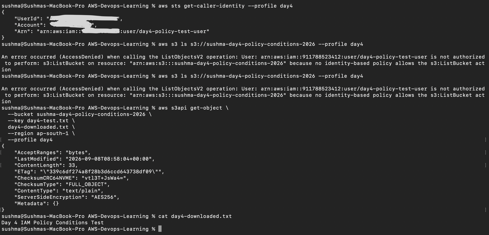

# 🔐 Day 4 — IAM Policy Conditions

## 📌 Overview

In Day 4, I learned how to use **IAM Policy Conditions** to control when an AWS permission is allowed.

I created a custom IAM policy that allows an IAM user to read an S3 object when the request is made in the **Mumbai (`ap-south-1`) AWS Region**.

I tested the policy using the AWS CLI and verified both allowed and denied actions.

---

## 🎯 What I Practiced

* IAM Policy Conditions
* `aws:RequestedRegion`
* IAM users
* Custom IAM policies
* S3 `GetObject`
* S3 `ListBucket`
* AWS CLI profiles
* IAM permission testing
* Least-privilege access
* `AccessDenied` troubleshooting
* AWS CLI credential troubleshooting
* STS identity verification

---

# 🏗️ Lab Flow

```text
AWS IAM User
     │
     ▼
day4-policy-test-user
     │
     ▼
Custom IAM Policy
Day4-S3-Region-Condition-Policy
     │
     │ Condition:
     │ aws:RequestedRegion = ap-south-1
     ▼
AWS CLI
--profile day4
     │
     ▼
Amazon S3
sushma-day4-policy-conditions-2026
     │
     ▼
day4-test.txt
```

---

# ☁️ AWS Resources

### S3 Bucket

```text
sushma-day4-policy-conditions-2026
```

**Region:**

```text
ap-south-1
```

### IAM User

```text
day4-policy-test-user
```

**Console access:**

```text
Disabled
```

### IAM Policy

```text
Day4-S3-Region-Condition-Policy
```

---

# 🔐 IAM Policy

```json
{
  "Version": "2012-10-17",
  "Statement": [
    {
      "Sid": "AllowS3ReadOnlyFromMumbaiRegion",
      "Effect": "Allow",
      "Action": "s3:GetObject",
      "Resource": "arn:aws:s3:::sushma-day4-policy-conditions-2026/*",
      "Condition": {
        "StringEquals": {
          "aws:RequestedRegion": "ap-south-1"
        }
      }
    }
  ]
}
```

## Policy Breakdown

### Action

```text
s3:GetObject
```

Allows the user to read/download objects.

### Resource

```text
arn:aws:s3:::sushma-day4-policy-conditions-2026/*
```

Applies to objects inside the specific S3 bucket.

### Condition

```text
aws:RequestedRegion = ap-south-1
```

Adds a condition requiring the request to use the Mumbai region.

---

# 💻 AWS CLI Configuration

Created a dedicated AWS CLI profile:

```text
day4
```

Command:

```bash
aws configure --profile day4
```

Configured region:

```text
ap-south-1
```

---

# 🔎 IAM Identity Test

Command:

```bash
aws sts get-caller-identity --profile day4
```

The result confirmed that the CLI was using:

```text
day4-policy-test-user
```

This verified that the Day 4 IAM user's credentials were being used.

---

# 📄 Created Test File

Created the test file:

```bash
echo "Day 4 IAM Policy Conditions Test" > day4-test.txt
```

Verified the content:

```bash
cat day4-test.txt
```

Output:

```text
Day 4 IAM Policy Conditions Test
```

---

# 🪣 S3 Permission Test — ListBucket

Tested:

```bash
aws s3 ls s3://sushma-day4-policy-conditions-2026 --profile day4
```

Result:

```text
AccessDenied
```

The user was not authorized to perform:

```text
s3:ListBucket
```

## Reason

The custom policy does not grant:

```text
s3:ListBucket
```

It only grants:

```text
s3:GetObject
```

This demonstrates restricted, least-privilege access.

---

# 📥 S3 Permission Test — GetObject

Tested:

```bash
aws s3api get-object \
  --bucket sushma-day4-policy-conditions-2026 \
  --key day4-test.txt \
  day4-downloaded.txt \
  --region ap-south-1 \
  --profile day4
```

Result:

```text
Successful
```

The object was successfully downloaded.

---

# ✅ Download Verification

Command:

```bash
cat day4-downloaded.txt
```

Output:

```text
Day 4 IAM Policy Conditions Test
```

The downloaded file matched the original test file.

---

# 📊 Final Test Results

| Test                         | Result         |
| ---------------------------- | -------------- |
| IAM identity verification    | ✅ Success      |
| `s3:ListBucket`              | ❌ AccessDenied |
| `s3:GetObject`               | ✅ Success      |
| Object download              | ✅ Success      |
| Downloaded file verification | ✅ Success      |

---

# 🛠️ Troubleshooting

## 1. InvalidClientTokenId

Initially, running:

```bash
aws sts get-caller-identity
```

returned:

```text
InvalidClientTokenId
```

### Cause

The default AWS CLI credentials were invalid.

### Solution

Created a dedicated Day 4 profile:

```bash
aws configure --profile day4
```

Then verified:

```bash
aws sts get-caller-identity --profile day4
```

The correct IAM user was returned.

---

## 2. ListBucket AccessDenied

Running:

```bash
aws s3 ls s3://sushma-day4-policy-conditions-2026 --profile day4
```

returned:

```text
AccessDenied
```

for:

```text
s3:ListBucket
```

### Cause

The policy does not include:

```text
s3:ListBucket
```

### Result

This was expected and confirmed that the IAM policy was restricting permissions correctly.

---

## 3. InvalidAccessKeyId

Running the S3 command without the Day 4 profile returned:

```text
InvalidAccessKeyId
```

### Cause

The command used the default AWS CLI credentials instead of the Day 4 profile.

### Solution

Use:

```text
--profile day4
```

Example:

```bash
aws sts get-caller-identity --profile day4
```

---

# 📸 Screenshot

The Day 4 lab screenshot demonstrates the complete Terminal testing flow.



The screenshot shows:

* IAM identity verification
* `ListBucket` AccessDenied
* `GetObject` success
* Downloaded file verification

---

# 🧠 Day 4 Learning Summary

Day 4 demonstrated how an IAM policy can use a **Condition** to make permissions more specific.

The lab showed:

```text
IAM User
   ↓
IAM Policy
   ↓
Action
   ↓
Resource
   ↓
Condition
```

The user was allowed to retrieve the specific S3 object while being denied permission to list the bucket.

---

## ⭐ Key Takeaways

* IAM Conditions add additional restrictions to permissions.
* `aws:RequestedRegion` can be used to restrict requests based on AWS Region.
* `s3:GetObject` allows reading an object.
* `s3:ListBucket` is a separate permission.
* An IAM policy can allow one action while denying another simply by not granting it.
* AWS CLI profiles help use different AWS credentials safely.
* `aws sts get-caller-identity` is useful for verifying which identity is being used.
* Least-privilege permissions should be preferred.
* `AccessDenied` should be investigated by checking the identity, action, resource, policy, and conditions.

