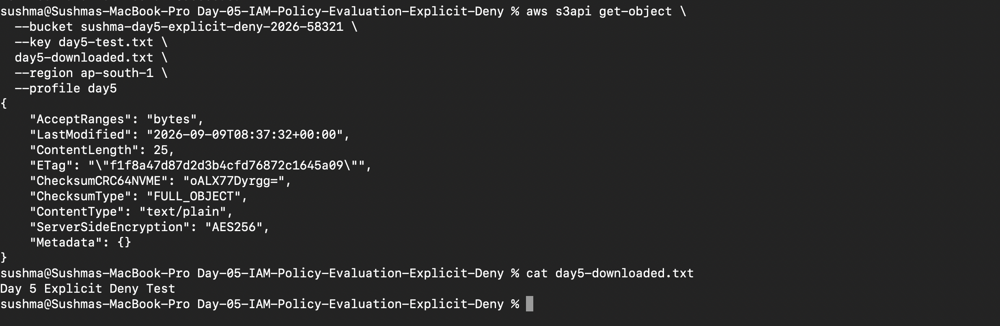
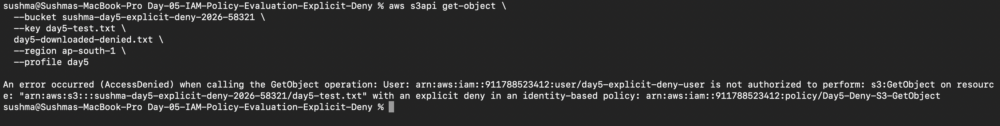

# Day 5 — IAM Policy Evaluation + Explicit Deny

## 📌 What I Learned

In Day 5, I learned how AWS evaluates IAM policies and how an **Explicit Deny overrides an Allow**.

I built a hands-on AWS lab using:

* IAM User
* IAM Allow Policy
* IAM Explicit Deny Policy
* Amazon S3
* AWS CLI
* Access Keys
* IAM Policy Evaluation

The main concept demonstrated in this lab was:

```text
Allow + Explicit Deny
        ↓
Explicit Deny wins
        ↓
AccessDenied
```

---

# 🏗️ What I Built

I created an S3 bucket and an IAM user.

The IAM user initially received an Allow policy that permitted:

```text
s3:GetObject
```

After proving that the user could download an S3 object successfully, I created and attached an Explicit Deny policy for the same action and resource.

I then tested the same command again.

The first test succeeded.

The second test returned:

```text
AccessDenied
```

This demonstrated that an Explicit Deny overrides an Allow.

---

# 🔧 AWS Resources Created

## 1. S3 Bucket

Bucket:

```text
sushma-day5-explicit-deny-2026-58321
```

Region:

```text
ap-south-1
```

The bucket contained:

```text
day5-test.txt
```

File content:

```text
Day 5 Explicit Deny Test
```

---

## 2. IAM User

IAM User:

```text
day5-explicit-deny-user
```

Console access:

```text
Disabled
```

The user was used for testing S3 permissions through AWS CLI.

---

# 📜 IAM Policy 1 — Allow

Policy name:

```text
Day5-Allow-S3-GetObject
```

This policy allowed the IAM user to read objects from the Day 5 S3 bucket.

Policy:

```json
{
  "Version": "2012-10-17",
  "Statement": [
    {
      "Sid": "AllowGetObject",
      "Effect": "Allow",
      "Action": "s3:GetObject",
      "Resource": "arn:aws:s3:::sushma-day5-explicit-deny-2026-58321/*"
    }
  ]
}
```

Important:

This policy allows:

```text
s3:GetObject
```

It does not automatically allow:

```text
s3:PutObject
s3:DeleteObject
s3:ListBucket
```

---

# 🔑 AWS CLI Authentication

I configured a separate AWS CLI profile for the Day 5 IAM user:

```bash
aws configure --profile day5
```

I configured:

```text
AWS Access Key ID
AWS Secret Access Key
Region: ap-south-1
Output: json
```

I verified the identity using:

```bash
aws sts get-caller-identity --profile day5
```

This confirmed that the CLI was using:

```text
day5-explicit-deny-user
```

---

# 📤 Uploading the Test File

The Day 5 IAM user only had:

```text
s3:GetObject
```

Therefore, it did not have:

```text
s3:PutObject
```

So I uploaded the test file using the AWS Console.

File:

```text
day5-test.txt
```

The upload succeeded.

---

# 🧪 Test 1 — Allow GetObject

I tested whether the Day 5 IAM user could download the S3 object.

Command:

```bash
aws s3api get-object \
  --bucket sushma-day5-explicit-deny-2026-58321 \
  --key day5-test.txt \
  day5-downloaded.txt \
  --region ap-south-1 \
  --profile day5
```

The command succeeded.

Then I verified the downloaded file:

```bash
cat day5-downloaded.txt
```

Output:

```text
Day 5 Explicit Deny Test
```

### Result

```text
s3:GetObject
      ↓
Allow policy
      ↓
SUCCESS ✅
```

Screenshot:

```text
screenshots/01-allow-getobject-success.png
```

---

# 🚫 IAM Policy 2 — Explicit Deny

After proving that the Allow worked, I created another IAM policy.

Policy name:

```text
Day5-Deny-S3-GetObject
```

Description:

```text
Explicitly denies S3 GetObject access to the Day 5 test bucket.
```

Policy:

```json
{
  "Version": "2012-10-17",
  "Statement": [
    {
      "Sid": "ExplicitDenyGetObject",
      "Effect": "Deny",
      "Action": "s3:GetObject",
      "Resource": "arn:aws:s3:::sushma-day5-explicit-deny-2026-58321/*"
    }
  ]
}
```

I attached this policy directly to:

```text
day5-explicit-deny-user
```

The user now had both policies:

```text
Day5-Allow-S3-GetObject
             +
Day5-Deny-S3-GetObject
```

---

# 🧪 Test 2 — Allow + Explicit Deny

I ran the same `GetObject` command again:

```bash
aws s3api get-object \
  --bucket sushma-day5-explicit-deny-2026-58321 \
  --key day5-test.txt \
  day5-downloaded-denied.txt \
  --region ap-south-1 \
  --profile day5
```

This time the request failed.

AWS returned:

```text
AccessDenied
```

AWS specifically reported:

```text
with an explicit deny in an identity-based policy
```

### Result

```text
Allow
  +
Explicit Deny
  ↓
Explicit Deny wins
  ↓
AccessDenied ❌
```

Screenshot:

```text
screenshots/02-explicit-deny-accessdenied.png
```

---

# 🧠 IAM Policy Evaluation Concept

The most important lesson from this lab is:

```text
Explicit Deny overrides Allow.
```

For example:

```text
IAM Policy
    │
    ├── Allow → s3:GetObject
    │
    └── Deny  → s3:GetObject
                    ↓
             Explicit Deny
                    ↓
                DENIED
```

Having an Allow policy does not guarantee access if another applicable policy contains an Explicit Deny.

---

# 🔍 Troubleshooting Method I Learned

When troubleshooting an IAM permission problem, I should not immediately add more permissions.

I should check:

```text
WHO?
 ↓
Which IAM identity?
 ↓
WHAT?
 ↓
Which AWS action failed?
 ↓
WHERE?
 ↓
Which resource?
 ↓
ALLOW?
 ↓
Is there an applicable Allow?
 ↓
DENY?
 ↓
Is there an Explicit Deny?
 ↓
TEST AGAIN
```

For this lab:

```text
WHO?
day5-explicit-deny-user

WHAT?
s3:GetObject

WHERE?
Day 5 S3 object

ALLOW?
Yes

EXPLICIT DENY?
Yes

FINAL RESULT?
AccessDenied
```

---

# 🎯 Important Commands Learned

### Check current AWS identity

```bash
aws sts get-caller-identity --profile day5
```

### Download an S3 object

```bash
aws s3api get-object \
  --bucket BUCKET_NAME \
  --key OBJECT_NAME \
  OUTPUT_FILE \
  --region ap-south-1 \
  --profile day5
```

### Check downloaded file

```bash
cat day5-downloaded.txt
```

### Check AWS CLI profiles

```bash
aws configure list-profiles
```

### Configure a named AWS CLI profile

```bash
aws configure --profile day5
```

---

# 🆚 Day 4 vs Day 5

## Day 4 — IAM Policy Conditions

I learned that IAM policies can use conditions to control when an Allow applies.

Example:

```text
Allow
 +
Condition
 ↓
Access depends on the condition
```

## Day 5 — Policy Evaluation + Explicit Deny

I learned that an Explicit Deny can override an Allow.

```text
Allow
 +
Explicit Deny
 ↓
DENY
```

---

# 💼 Real-World Interview Explanation

If an interviewer asks:

> "What happens if one IAM policy allows an action and another policy explicitly denies the same action?"

I can answer:

> "AWS evaluates all applicable policies. If there is an applicable Explicit Deny, it overrides any Allow, so the request is denied."

---

# 📸 Screenshots

### Allow Test



### Explicit Deny Test



---

# ✅ Day 5 Completed

* IAM Policy Evaluation
* Explicit Deny
* Allow vs Deny
* IAM User
* S3 GetObject
* AWS CLI profile
* STS identity verification
* AccessDenied troubleshooting
* Identity-based policy
* Least-privilege permissions
* Hands-on AWS testing

## ⭐ Main Lesson

```text
ALLOW + EXPLICIT DENY
          ↓
   EXPLICIT DENY WINS
          ↓
      AccessDenied
```

