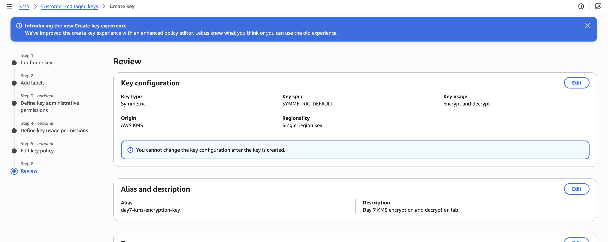

# Day 7 — AWS Key Management Service (KMS)

## KMS — Encryption, Decryption & Key Management

### 📌 Objective

The objective of this lab was to understand:

* What AWS KMS is
* KMS encryption and decryption
* Symmetric KMS keys
* Key administrators
* Key users
* KMS key policies
* AWS-managed keys
* Customer-managed keys
* How KMS integrates with AWS services
* How to configure KMS securely

---

# 🏗️ KMS Overview

AWS Key Management Service (KMS) is a managed AWS service used to create and control cryptographic keys.

KMS helps protect data by controlling who can use encryption keys and what operations they can perform.

Basic flow:

```text
                AWS KMS
                   │
                   ↓
             KMS Key
                   │
          ┌────────┴────────┐
          ↓                 ↓
      Encrypt            Decrypt
          ↓                 ↓
     Protected Data     Original Data
```

---

# 🌎 AWS Region

The lab was performed in:

```text
Region: Asia Pacific (Mumbai)
Region Code: ap-south-1
```

---

# 🔐 KMS Key Configuration

I explored the customer-managed key creation workflow.

The configuration reviewed for the lab was:

```text
Key Type:
Symmetric

Key Usage:
Encrypt and decrypt

Origin:
AWS KMS

Regionality:
Single-region key

Alias:
day7-kms-encryption-key

Description:
Day 7 KMS encryption and decryption lab
```

> **Note:** The customer-managed KMS key was not created. The configuration was reviewed during the key creation workflow as part of a cost-safe learning lab.

---

# 👤 Key Administrator

The IAM user:

```text
sushma
```

was selected as the key administrator during the configuration review.

A key administrator can perform management operations on the KMS key, such as:

* Manage key configuration
* Manage key policy
* Enable or disable the key
* Schedule key deletion
* Manage tags and aliases

---

# 🔑 Key User

The IAM user:

```text
sushma
```

was also selected as the key user during the configuration review.

The key policy included permissions such as:

```text
kms:Encrypt
kms:Decrypt
kms:ReEncrypt*
kms:GenerateDataKey*
kms:DescribeKey
```

This demonstrates the difference between:

```text
Key Administrator
        ↓
Manages the key

Key User
        ↓
Uses the key for cryptographic operations
```

---

# 📜 KMS Key Policy

The KMS key policy controls how the KMS key can be used.

Important permissions observed during the configuration review included:

```text
kms:Encrypt
kms:Decrypt
kms:DescribeKey
```

The policy also contained administrative permissions for the selected key administrator.

---

# ☁️ AWS Managed Keys

I checked:

```text
KMS
 ↓
AWS managed keys
```

The Mumbai region contained AWS-managed keys including:

```text
aws/secretsmanager
aws/rds
```

AWS-managed keys are created and managed by AWS services for supported service integrations.

---

# 💰 Cost-Safe Lab Approach

Because customer-managed KMS keys can result in ongoing charges, I did not create the customer-managed key after reviewing its configuration.

Instead, I focused on understanding:

* KMS concepts
* Key configuration
* Key administrators
* Key users
* Key policies
* AWS-managed keys
* Encryption/decryption concepts

This avoided creating an unnecessary customer-managed KMS resource for a temporary learning lab.

---

# 📸 Screenshot Evidence

The lab contains the following screenshot:

```text
screenshots/
└── 01-kms-key-configuration-review.png
```

### KMS Key Configuration Review



The screenshot shows the KMS customer-managed key configuration and review settings explored during the lab.

> **Security Note:** Sensitive AWS account information should be hidden before publishing screenshots to a public GitHub repository.

---

# 🧠 Key Concepts Learned

## Encryption

Encryption converts readable data into protected data.

```text
Plaintext
   ↓
Encryption
   ↓
Ciphertext
```

## Decryption

Decryption converts protected data back into readable data when an authorized identity has permission.

```text
Ciphertext
   ↓
Decryption
   ↓
Plaintext
```

## Symmetric Key

A symmetric KMS key uses the same cryptographic key for encryption and decryption operations.

---

# ⭐ Interview Summary

If asked:

> What is AWS KMS?

Answer:

> AWS KMS is a managed AWS service used to create and control cryptographic keys and control how those keys are used for encryption and decryption. It integrates with AWS services and provides centralized key management and auditing.

---

# 🎯 What I Practiced

```text
AWS KMS
   ↓
Customer-managed key workflow
   ↓
Symmetric key
   ↓
Encrypt & decrypt usage
   ↓
Key administrator
   ↓
Key user
   ↓
Key policy
   ↓
AWS-managed keys
   ↓
Cost-safe AWS lab
```

---

# ✅ Day 7 Status

* KMS opened in Mumbai region
* Symmetric key configuration understood
* Encrypt and decrypt usage understood
* Key administrator understood
* Key user understood
* KMS key policy reviewed
* AWS-managed keys examined
* KMS screenshot captured
* Customer-managed key was not created to avoid unnecessary lab costs
* Screenshot linked directly in this README

