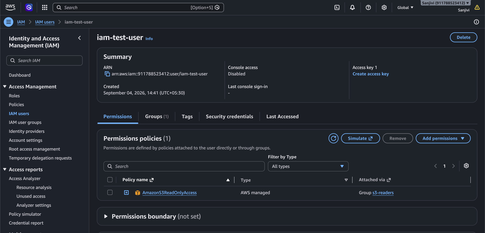
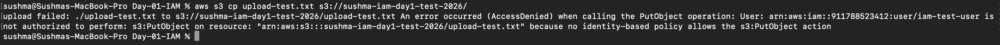

i# AWS IAM Hands-On Lab – Day 01

## 📌 Project Overview

This project is a hands-on AWS IAM lab created as part of my AWS DevOps learning journey.

The objective of this lab was to understand how AWS Identity and Access Management (IAM) controls access to AWS resources using users, groups, and policies.

I created an IAM user with read-only access to an Amazon S3 bucket and tested different S3 operations using the AWS CLI.

The user was able to list and read S3 objects, but was not allowed to upload or delete objects.

This demonstrates the **Principle of Least Privilege**.

---

## 🏗️ Architecture / Permission Flow

```text
                    AWS IAM
                       |
                       |
                iam-test-user
                       |
                       ↓
                 s3-readers
                  IAM Group
                       |
                       ↓
          AmazonS3ReadOnlyAccess
                  IAM Policy
                       |
                       ↓
               Amazon S3 Bucket
        sushma-iam-day1-test-2026
                       |
          ┌────────────┼────────────┐
          ↓            ↓            ↓
       List/Read     Upload       Delete
          ✅            ❌            ❌
        Allowed       Denied       Denied
```

---

## 🎯 Objectives

* Understand AWS IAM fundamentals
* Create an IAM user
* Create an IAM group
* Attach an IAM policy to a group
* Add an IAM user to the group
* Understand AWS managed policies
* Configure AWS CLI authentication
* Verify IAM identity using AWS STS
* Test S3 permissions using AWS CLI
* Understand `AccessDenied` errors
* Understand the Principle of Least Privilege

---

# ☁️ AWS Services Used

### 1. AWS IAM

Used to manage identities and permissions.

Resources created:

* IAM User: `iam-test-user`
* IAM Group: `s3-readers`
* IAM Policy: `AmazonS3ReadOnlyAccess`

### 2. Amazon S3

Used as the AWS resource on which IAM permissions were tested.

S3 Bucket:

```text
sushma-iam-day1-test-2026
```

Test object:

```text
test.txt
```

### 3. AWS CLI

Used to interact with AWS from the terminal and test IAM permissions.

### 4. AWS STS

Used to verify which IAM identity was being used by the AWS CLI.

---

# 🔐 IAM Configuration

## IAM User

Created an IAM user:

```text
iam-test-user
```

This user was used for testing AWS permissions through the AWS CLI.

---

## IAM Group

Created an IAM group:

```text
s3-readers
```

The IAM user `iam-test-user` was added to this group.

---

## IAM Policy

Attached the AWS managed policy:

```text
AmazonS3ReadOnlyAccess
```

This policy provides read-only access to Amazon S3.

Therefore, the user can perform read/list operations but does not have permissions such as:

```text
s3:PutObject
s3:DeleteObject
```

---

# 🖥️ AWS CLI Configuration

The AWS CLI was configured using the IAM user's access credentials.

Command used:

```bash
aws configure
```

Region:

```text
ap-south-1
```

The `ap-south-1` region represents the **Mumbai AWS Region**.

The AWS CLI was then used to test the permissions assigned to `iam-test-user`.

---

# 🔎 Verify IAM Identity

Command:

```bash
aws sts get-caller-identity
```

This command verifies the AWS identity currently being used by the AWS CLI.

The output confirmed that the CLI was using:

```text
iam-test-user
```

---

# 🧪 Permission Testing

## Test 1 – List S3 Buckets

Command:

```bash
aws s3 ls
```

### Result

```text
Allowed ✅
```

The IAM user was able to list S3 buckets.

---

## Test 2 – List Objects in the S3 Bucket

Command:

```bash
aws s3 ls s3://sushma-iam-day1-test-2026
```

The output showed:

```text
test.txt
```

### Result

```text
Allowed ✅
```

The IAM user was able to list objects in the bucket.

---

## Test 3 – Upload an Object

Command:

```bash
aws s3 cp upload-test.txt s3://sushma-iam-day1-test-2026/
```

### Result

```text
AccessDenied ❌
```

The error indicated that the user was not authorized to perform:

```text
s3:PutObject
```

### Why?

The `AmazonS3ReadOnlyAccess` policy does not provide permission to upload objects.

Therefore:

```text
s3:PutObject → Denied ❌
```

---

## Test 4 – Delete an Object

Command:

```bash
aws s3 rm s3://sushma-iam-day1-test-2026/test.txt
```

### Result

```text
AccessDenied ❌
```

The error indicated that the user was not authorized to perform:

```text
s3:DeleteObject
```

### Why?

The `AmazonS3ReadOnlyAccess` policy does not provide permission to delete objects.

Therefore:

```text
s3:DeleteObject → Denied ❌
```

---

# 📊 Permission Test Results

| Operation           | Permission            | Result    |
| ------------------- | --------------------- | --------- |
| List S3 buckets     | `s3:ListAllMyBuckets` | ✅ Allowed |
| List bucket objects | S3 List permission    | ✅ Allowed |
| Read S3 objects     | S3 Read permission    | ✅ Allowed |
| Upload object       | `s3:PutObject`        | ❌ Denied  |
| Delete object       | `s3:DeleteObject`     | ❌ Denied  |

---

# 🔐 Principle of Least Privilege

The **Principle of Least Privilege** means giving a user, application, or service only the permissions required to perform its intended tasks.

In this lab, the user only required read access to S3.

Therefore, instead of giving the user full S3 permissions, I assigned:

```text
AmazonS3ReadOnlyAccess
```

As a result:

```text
Read/List → Allowed ✅
Upload → Denied ❌
Delete → Denied ❌
```

This reduces unnecessary access and improves security.

---

# 📚 What I Learned

Through this hands-on lab, I learned:

### IAM Fundamentals

* What AWS IAM is
* IAM Users
* IAM Groups
* IAM Policies
* Authentication
* Authorization
* Least Privilege

### IAM User

An IAM user represents an identity that can authenticate and interact with AWS resources according to its permissions.

### IAM Group

An IAM group is a collection of IAM users.

Permissions can be assigned to the group so that users in the group inherit those permissions.

### IAM Policy

An IAM policy is a JSON-based document that defines permissions.

It determines:

```text
Effect
Action
Resource
```

For example:

```text
Allow → Read S3
Deny/No permission → Upload
Deny/No permission → Delete
```

### AWS Managed Policy

I used:

```text
AmazonS3ReadOnlyAccess
```

This is an AWS managed policy that provides read-only access to S3.

### AWS CLI

I learned how to configure and use the AWS CLI:

```bash
aws configure
```

### AWS STS

I learned how to verify the currently authenticated identity:

```bash
aws sts get-caller-identity
```

### AccessDenied Troubleshooting

I learned that an `AccessDenied` error can occur when the IAM identity does not have permission to perform a particular AWS action.

For example:

```text
s3:PutObject → AccessDenied
s3:DeleteObject → AccessDenied
```

---

# 🛠️ Commands Practiced

```bash
aws configure
```

```bash
aws sts get-caller-identity
```

```bash
aws s3 ls
```

```bash
aws s3 ls s3://sushma-iam-day1-test-2026
```

```bash
aws s3 cp upload-test.txt s3://sushma-iam-day1-test-2026/
```

```bash
aws s3 rm s3://sushma-iam-day1-test-2026/test.txt
```

---

# 📸 Screenshots

The following screenshots document the hands-on lab:

### 1. IAM Group


Shows the `s3-readers` IAM group and its attached S3 read-only policy.

### 2. IAM User



Shows the `iam-test-user` IAM user and its group membership.

### 3. S3 Read Access


Shows successful access to list objects in the S3 bucket.

### 4. S3 Upload Denied



Shows `AccessDenied` for the `s3:PutObject` operation.

### 5. S3 Delete Denied


Shows `AccessDenied` for the `s3:DeleteObject` operation.

---

# 💡 Key Takeaway

This lab demonstrated how IAM can control access to AWS resources using users, groups, and policies.

The `iam-test-user` received only S3 read permissions through the `s3-readers` group.

As a result:

```text
                 iam-test-user
                       |
                       ↓
                 s3-readers
                       |
                       ↓
       AmazonS3ReadOnlyAccess
                       |
                       ↓
                      S3
             ┌─────────┴─────────┐
             ↓                   ↓
        Read/List             Modify
           ✅                    ❌
```

This hands-on test demonstrates the importance of **least-privilege access control in AWS**.

---

# 🚀 Next Learning Topics

After completing this IAM lab, the next IAM topics I will study are:

* IAM Policy Types
* Identity-Based Policies
* Resource-Based Policies
* Trust Policies
* Permissions Policies
* Inline Policies
* AWS Managed Policies
* Customer Managed Policies
* Policy Evaluation Logic
* Explicit Deny vs Allow
* IAM Roles
* EC2 IAM Roles
* Instance Profiles
* STS Temporary Credentials
* Permissions Boundaries
* Service Control Policies (SCPs)
* Cross-Account IAM Roles
* IAM Troubleshooting

---

## 👩‍💻 Project Status

**Status:** Completed ✅

**Day:** 01

**Topic:** AWS IAM

**Hands-on:** IAM + S3 + AWS CLI

**Key Security Concept:** Principle of Least Privilege

